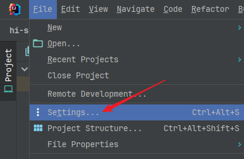

# hi-springboot-gradle

spring boot gradle demo

本项目是一个基于Spring Boot框架和Gradle构建工具的Java Web应用程序示例。项目中不同的分支展示了不同的JDK、Gradle和Spring Boot版本依赖关系，旨在帮助开发者更好地理解和管理版本兼容性。

## branch

| Branch                              | JDK   | Gradle | SpringBoot |
| ----------------------------------- |-------| ------ |------------|
| main                                | 21 LTS    | 8.x    | 3.3.x      |
| [8-6.8-2.7](../../tree/8-6.8-2.7)   | 8  LTS    | 6.8.x  | 2.7.x      |
| [11-6.9-2.7](../../tree/11-6.9-2.7) | 11 LTS    | 6.9.x  | 2.7.x      |
| [17-7.6-3.0](../../tree/17-7.6-3.0) | 17 LTS    | 7.6.x  | 3.0.x      |
| [17-8-3.1](../../tree/17-8-3.1)     | 17 LTS    | 8.x    | 3.1.x      |


## System Requirements

https://docs.spring.io/spring-boot/system-requirements.html


## version

- open JDK 21 https://adoptium.net/temurin/archive/
- gradle 8.10.2 https://gradle.org/releases/
- spring boot 3.3.4 https://spring.io/projects/spring-boot


## Run

### 下载

- 手动下载zip


- git命令下载

  ```sh
  # 进入要存放项目的目录
  cd e:\demo
  # 使用git拉取
  git clone git@gitee.com:hi-sample/hi-springboot-gradle.git
  ```

  

### 打开项目

使用IEDA打开项目

 

 


### 配置项目

配置JDK

 

选择项目对应的JDK版本


配置Gradle

 

配置gradle使用的JDK与项目一致"Project SDK"


### 运行

等待依赖包自动下载完成后，点击右上角运行按钮运行项目

 

